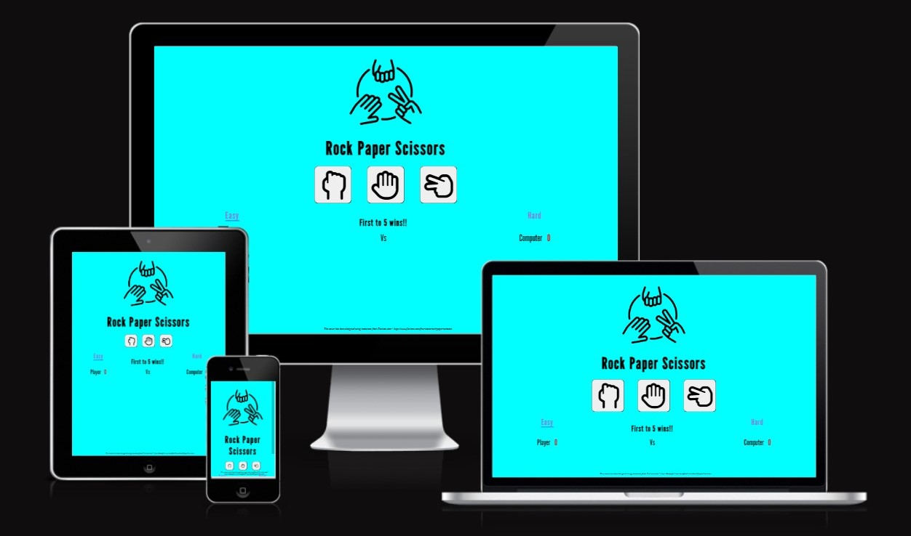
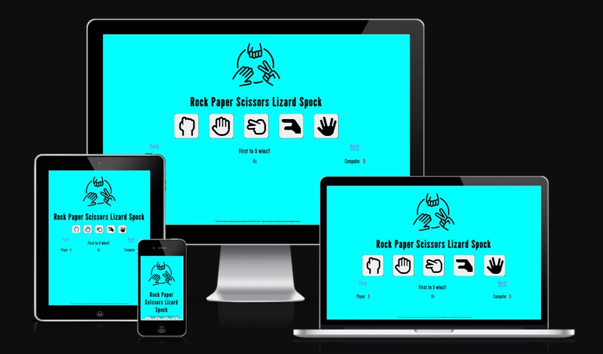
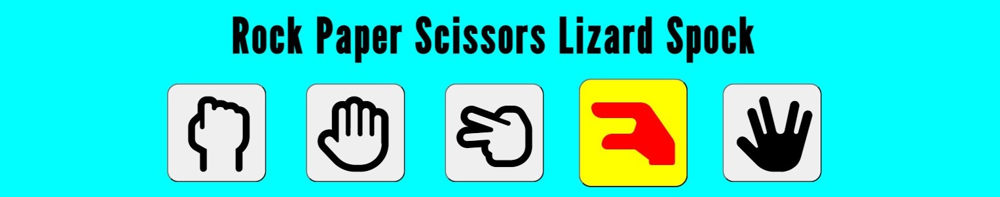
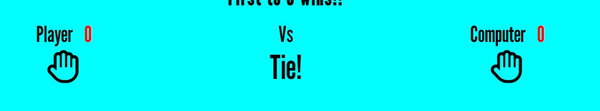
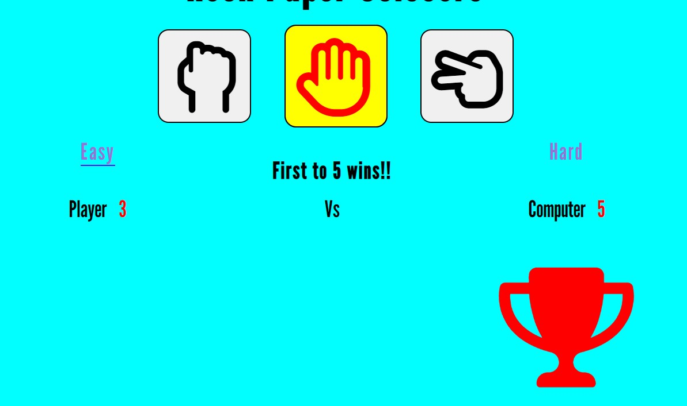

# Rock Paper Scissors

This website is a modern-play on the age-old game of Rock Paper Scissors in user-friendly, and interactive manner. The website challenges the player to beat the computer, in a game of first to 5!

There are two game-play modes, Easy and Hard.

The Easy game has Rock Paper Scissors options.

The Hard game introduces two additonal options, Lizard and Spock, to create Rock Paper Scissors Lizard Spock.

# Features
## Logo and Heading
* The head of the landing page is a creative graphic of Rock Paper Scissors, with the title clearly noted below the image in bold.

## Game Play Options
* The game-play options are in big-button format. 
* The Easy Game has three options of Rock Paper Scissors.
* The Hard Game has five options of Rock Paper Scissors Lizard Spock.
* Each option magnifies and highlights on hover, for increased interactivity with the player.

## Game Difficulty Levels
* Below the game-play buttons, you will find the game difficulty selection- 'Easy' and 'Hard'.
* Current game selection will be underlined.
* Basic game rule of 'First to 5 wins'.

## Game Score Area
* The game scores are clearly split into left and right zones. 
* Once the Player selects a button, it gets pinned underneath the Player score zone. 
* The Computer selection is then randomly generated, and pinned beneath the Computer score zone automatically. 
* Both selections are assessed and the result is pinned to the centre zone. If there is a Player or Computer win, the respective score counter is increased. If it is a tie, both scores remain the same.

* Once the either score has reached 5, the champion will be crowned under the respective zone.

## Game Reset
* After a pause of 3 secs, the score counters reset and the score area is cleared for a new game.

# Testing

* Tested the website for responsiveness via the google devtools for different screen sizes.

* Tested the game win scenarios to ensure the correct game logic.

* Tested game play scenarios to ensure the correct champion is selected.

* Tested that both the score area and counters reset for next game.

# Vaildator Testing 

* HTML
    * Ran code through W3C code validator check and corrected all errors.
* CSS 
    * Ran code though W3C CSS code validator and corrected all errors.
* JavaScript
    * Ran code though W3C JShint validator and corrected all errors, mainly missing semi-colons.
    * Produced the following metrics:
        * There are 19 functions in this file.
        * Function with the largest signature take 1 arguments, while the median is 0.
        * Largest function has 15 statements in it, while the median is 8.
        * The most complex function has a cyclomatic complexity value of 6 while the median is 2.
    * One warning was produced:
        * Functions declared within loops referencing an outer scoped variable may lead to confusing semantics.       (appendUserSelection, randomChoice, oneClick, appendSelection, tie, rockArray, paperArray, scissorsArray, lizardArray, spockArray).
        * Will take warning on board for future JavaScript functions.

* Lighthouse
    * Ran the code through Lighthouse in google dev tools and added aria-labels to the button selections to increase accessibility as per the recommendations.

        * Easy game Lighthouse Score

    * Hard game Lighthouse Score

# Deployment
* The site was deployed to Github Pages. The steps to depoly were as follows:
    * From the Github repository Rock Paper Scissors, navigate to settings tab.
    * Next, on the left hand side menu under 'Code and automation' find and click the 'pages' tab.
    * Change the branch to Main and click Save in order for website to be deployed. Wait a few minutes and refresh for the green published status. 

Link to website - https://pthorkan.github.io/Rock-Paper-Scissors/

# Credit

* Initial game play ideas were developed after watching Web Dev Simplified tutorial on youtube.
* The image animation fading on the volunteer page was taken from GeeksforGeeks website, article called 'How to create fade-in effect on page load using CSS ?'.
* Various Html, CSS and JavaScript code hacks taken from W3Schools and stackoverflow forums and adapted to suit.

## Images
* The game logo was taken from Freepik - Flaticon website. Ref="https://www.flaticon.com/free-icons/rock-paper-scissors"
* Game button icons were taken from Font Awesome website, from the free library.